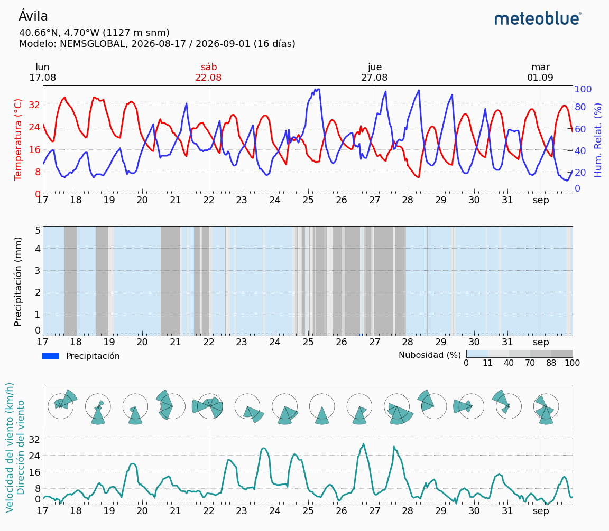

# ESP32 EDGE ANOMALY DETECTION
## Introducción
Este proyecto comienza en Agosto de 2026, como una propuesta de detección de anomalías a partir de datos obtenidos por los sensores del ESP32, para ello se usaron los siguientes sensores:

- Sensor de temperatura y humedad DHT11.
- Sensor de movimiento HC SR501 PIR.
- Sensor de luminosidad DollaTek Digital Light Intensity Sensor.
- Además del timestamp, que lo genera el propio Google Apps Script al insertar la fila.
  
Para el desarrollo de este objetivo se tuvo que implementar un sistema de aprendizaje no supervisado, que se detallará más adelante.

##  Proceso de Montaje
Para comenzar con este proyecto se tuvo que aprender a manejar los componentes electrónicos del ESP32, así como las conexiones, entradas salidas, módulos, conexión a internet, voltajes, librerías para el manejo de estos componentes, Google Sheets para empaquetar los datos y mandarlos a un Google Sheet para poder mantener el sistema funcionando de forma constante sin necesidad de conectarse por cable o wifi a un ordenador siempre encendido. 
Una vez entendidas estas bases se procedió con el montaje y testing de los módulos individuales, ante lo cual surgieron diversos problemas:

- El módulo **HC-SR501-PIR** estaba desregulado, la sensibilidad del sensor hacía que se activase con mínimos movimientos, o el otro extremo, el movimiento debía de ser muy continuo y sostenido para que el ciclo de actualización recogiese eso como movimiento, lo cual tomó días de datos para comprobar si la tendencia era constante, resultando en la eliminación de una semana de datos por estar sobrerrepresentados los 1 o los 0 en la columna de movimiento, pudiendo resultar en un mal entrenamiento. Para solucionarlo se tuvo que manualmente desatornillar el regulador del sensor para ajustar su sensibilidad.
- Google Sheet no permitía crear un documento que actuase como base de datos por tener varias sesiones abiertas, su solución ampliamente conocida fue abrir una pestaña en modo incógnito e iniciar sesión ahí, tras eso como el microcontrolador ESP32 no tiene la capacidad de gestionar fácilmente la autenticación OAuth2 compleja de Google, establecimos un Webhook HTTP utilizando Google Apps Script como puente de comunicación con un sencillo código de JavaScript basado en La función doGet(e), que captura los parámetros pasados en la URL de la petición HTTP, extrae las lecturas y las escribe con un sheet.appendRow().
- Se optó por comprar una powerbank no inteligente, es decir, que con consumos bajos (como el del ESP32) no se apague automáticamente para ahorrar batería, tras esto se descubrió que la capacidad anunciada no se traduce directamente a energía usable (calor, conversión de voltaje, resistencia interna de las celdas), lo que reduce drásticamente el tiempo de vida útil del Powerbank, apagando el ESP32 en cuestión de días. La solución fue cambiar la fuente de Powerbank a enchufe de pared, pues el ESP32 estará estático durante todo el proceso.
- Al desconectar el ESP32 o apagarse por factores externos, este devuelve valores incoherentes (Filas a 0) antes de quedar totalmente apagado, denominado efecto Brownout, datos que luego cribaremos, en total 8 datos fueron eliminados.

Tras recopilar datos durante 13 días, con varias caídas durante horas por los problemas mencionados, se importó la tabla completa en el Notebook de Jupyter y se comenzó con el análisis y depuración de los datos.
### Procesado, Representación, Limpieza y Conversión de los datos
Para la depuración de los datos primero se tuvo que representarlos, para ello se usaron varias configuraciones y correlaciones.

La representación de la temperatura fue un indicador claro para determinar los valores donde el Brownout hizo efecto, y cribar cuando la temperatura es menor de 10 grados, pasando de 13 141 a 13 133 filas.

Se detectó que el nivel de luz se presentaba de forma contraintuitiva debido al funcionamiento de la fotorresistencia (LDR), devolviendo datos mayores a cuanta menos luz incide en el. Para hacerlo más legible se decidió invertir este valor, para obtener valores más bajos a cuanta menos luz hay en la estancia. 

El % de filas con el flag de Movimiento a 1 y la representación gráfica fue útil para detectar el primer problema mencionado y ajustar la sensibilidad del sensor, además de calcular la correlación de Pearson entre ambas variables para descubrir si existe una relación entre la luz y el movimiento, resultando en 0.038831, dando una primera teoría de que hay una relación lineal muy débil, para mayor rigurosidad usaremos el **Test t de Student**, el cual muestra que el nivel de luz difiere de forma estadísticamente significativa según el estado del PIR (t = −4.58, p ≈ 4.8·10⁻⁶), con mayor luz cuando hay movimiento. Sin embargo, el efecto es pequeño (r = 0.039): la luz por sí sola no permite predecir la presencia, por lo que se emplea un modelo multivariante.

##  Decisión y entrenamiento del Modelo
Una vez depurado el dataset se comenzó con la investigación del modelo a usar. 

Se barajaron diversas ideas, pasando por un modelo de clasificación con clustering, DBSCAN (asume una distribución unimodal y elíptica, cuando nuestros datos son cíclicos), distancia Mahalanobis, entre otros, pero debido a su complejidad, escalabilidad y consumo de memoria se tomó la decisión de usar Isolation Forest, pues es un modelo de aprendizaje no supervisado de bajo consumo ideal para este tipo de escenarios. 

La base matemática detrás del modelo es sencilla, se coge un atributo aleatorio, y dentro de su rango min max se hace un corte aleatorio, se coge un valor de umbral y se separa el dataset en dos sub conjuntos, y este proceso se repite n veces. Esto resulta en un contador de profundidad por cada patrón, cuantos más cortes se hayan requerido para aislar ese dato, más cerca estará del cluster principal, y cuantos menos cortes se hayan requerido para aislar ese dato, más probable es que este sea un dato atípico.

Tras el entrenamiento del modelo usando sklearn, se pasó este mismo por cada dato, marcando los que son datos atípicos y construyendo con ellos un archivo csv, teniendo en cuenta que el valor contamination está fijado a 0.01, por lo que marca el 1% como anomalías por construcción.
Estos datos del csv reflejan el comportamiento del modelo, dando varios conjuntos de datos, separados por días, que se detectaron como anomalías, por ejemplo, el día 2026-08-18, donde se encuentran variaciones extremas de la luz, para luego quedarse en el 0 absoluto, algo que no suele pasar en un día normal, este caso específico se debió a un cambio en la disposición del montaje mientras este estaba aún funcionando, moviendo ligeramente el sensor de luz, y tapándolo mientras se hicieron los cambios. Otro ejemplo es el bloque de datos del día 21 al 27, donde en la provincia de Ávila, conocida por tener mucha sequedad en agosto, se topó con una semana de humedad relativamente alta, coincide con un periodo de humedad detectada alta: el sensor registró hasta 40 %, frente al 9–15 % habitual en el resto de los datos.

Fuente: meteoblue, simulación del modelo NEMSGLOBAL.

En total se marcaron 132 puntos atípicos, haciendo uso de 15 árboles y max_samples=256 dando ~2 900 nodos (~35 KB de arrays), un tamaño que cabe sin problemas en la RAM del ESP32.

